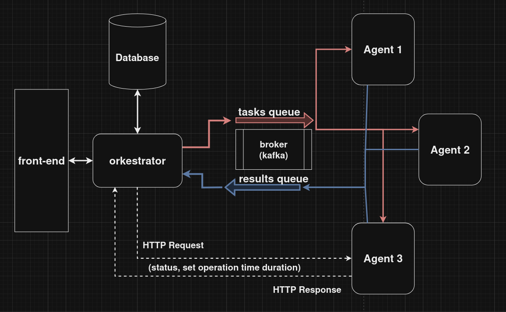

# SuperCalculator

SuperCalculator - проект, имитирующий отказоустойчивый
механизм орекстрации трафика/задач/сообщений между сущностями, 
которые вычисляют и выполняют эти задачи. Имитация происходит за счёт
вычисления математических выражений

## Schema
Проект имеет следующую структуру:



front-end часть в проекте отсутствует.

## Description

**Есть 4 вида запросов:**
1. Получить информацию по задачам
2. Установить время выполнения каждой операции, 
а также время ожидания для запросов и выполнения задания
3. Получить информацию о состоянии агентов
4. Создать новую задачу

За счет сохранения всех задач в БД, 
при отказе любого из компонентов задача не потеряется и останется в БД.

После создания задачи, она отправляется на брокер в tasks очередь в формате JSON. 
Из этой очереди агенты забирают задачи, вычисляют и отправляют обратно в очередь results.

Как только оркестратор получает результат, он сохраняет его в БД и помечает как выполненную. 
При этом, у оркестратора есть механизм повторной отправки задач, если результат задач не пришел спустя какое-то время

Мониторинг агентов (а также их настройка) осуществлен простым HTTP запросом с таймаутом.

## Structure

```
├── back-end
│ ├── agent - исходники агента
│ │ ├── api - сюда должна генерироваться документация
│ │ ├── cmd - точка входа
│ │ ├── internal
│ │ │ ├── agent_errors - кастомные внутренние ошибки
│ │ │ ├── app - инициализация и сборка приложения
│ │ │ ├── config - конфигурация агента
│ │ │ ├── services - слой сервиса
│ │ │ └── transport - слой транспорта (rest, kafka)
│ ├── db - папка с файлом БД для sqlite3
│ ├── models - общие модели сообщений и таблиц БД
│ └── orkestrator - исходники для оркестратора
│     ├── api - сюда должна складываться документация по api
│     ├── cmd - точка входа
│     ├── internal
│     │ ├── app - инициализация и сборка приложения
│     │ ├── clierrs - кастомные клиентские ошибки
│     │ ├── config - конфигурация
│     │ ├── interfaces - интерфейсы для соединения слоев
│     │ ├── repository - слой данных (хранилища)
│     │ ├── services - слой сервиса и бизнес логики
│     │ └── transport - транспортный слой (rest, kafka broker)
└── front-end - здесь должен был быть фронт((
```

В .env файле можно редактировать некоторые настройки системы

# How to use

Для запуска системы нужны Go v1.21.6 (и выше) и Docker вместе с docker-compose

## Windows preinstalling

Go-sqlite3 требует gcc компилятор, которого по умолчанию нет в Windows. Для установки, можно перейти на сайт https://jmeubank.github.io/tdm-gcc/ и установить его


## Quick start

Для качественного просмотра работы системы, рекомендую пропустить этот пункт и спуститься ниже к пункту **Start in multiple termunals**. Однако, для простого запуска, хватит и этого

1. Установить зависимости``go mod tidy``

#### On Mac/Linux

```
./run_local.sh
```

#### On Windows

```
.\run_local.ps1
```

## Start in multiple terminals

1. Установить зависимости
```
go mod tidy
```
2. Запустить kafka брокер
```
docker-compose -f docker-compose-kafka.yml up -d
```
3. Переименовать .env.example в .env и отредактировать HTTP порты и адреса под себя (указать URL адреса для агентов, например)
```
HTTP_AGENT_ADDRESSES="localhost:8001/api/v1;localhost:8002/api/v1"
```
4. Запустить оркестратор
```
go run -v ./back-end/orkestrator/cmd/app/main.go serve
```
5. Запустить агенты (в отдельных терминалах)
```
go run -v ./back-end/agent/cmd/app/main.go s --http_port <порт агента> --agent_id <id от 0 до макс. кол-во агентов>
```

## Requests

Если вы пользуетесь Postman, то можно импортировать коллекцию Calculator.postman_collection.json
Таймаут ответа от агента и период повторной отправки указываются в секундах, время выполнения операций - в миллисекундах

### Curl requests
Create task
```
curl -L 'http://localhost:8000/api/v1/manager' \
-H 'Content-Type: application/json' \
-d '{
    "expression": "11+11+11"
}'
```
Get all tasks
```
curl -L 'http://localhost:8000/api/v1/manager/tasks'
```
Set settings (operation time in millisecond, timeout and time retry in seconds)
```
curl -L -X PUT 'http://localhost:8000/api/v1/manager/settings' \
-H 'Content-Type: application/json' \
-d '{
    "timeout_response": 10,
    "time_retry": 10,
    "add_time": 5000,
    "division_time": 6000,
    "subtract_time": 10,
    "multiply_time": 5
}'
```
Get workers info
```
curl -L 'http://localhost:8000/api/v1/manager/workers'
```
