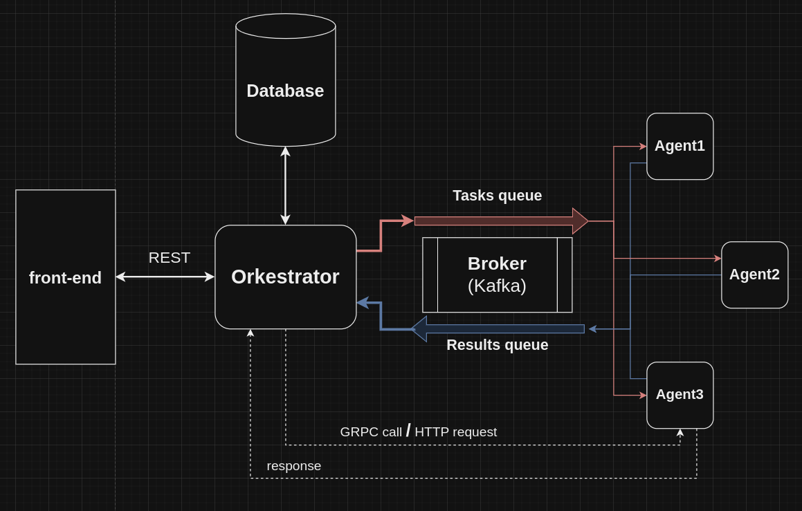

# SuperCalculator

## Table of contents

- ### [What is it?](..%2FREADME.md#what-is-it)
- ### [How to run?](..%2FREADME.md#running)
- ### [How to use?](usage.md)
- ### [How it works?](howItWorks.md)
- ### [Project sructure](..%2FREADME.md#project-structure)

## How it works

Есть 4 основных компонента:
* **Оркестратор** (написанный лично на Go)
* **Агент** (написанный лично на Go)
* **Брокер сообщений** (Kafka)
* **База данных** (PostgreSQL/SQLite3)

Задания (математические выражения, которые нужно вычислить) **передаются агентам через брокер сообщений** (очередь tasks),
а результаты вычислений на агентах отправляются обратно в брокер сообщений (очередь results).

Чтобы полученные задания не терялись в случае отключения оркестратора, все они сохраняются в БД
при получении с атрибутом is_executed=false. При повторном подключении, оркестратор проверяет записи в БД на наличие
не выполненных заданий и отправляет их в очередь брокера.
После получения результатов вычисления, соответствующая запись в БД обновляется.

Также, у оркестратора есть **кэш** полученных **задач**.
Если он не получает результат по ним через какой-то заданный интервал времени,
то снова отправляет их в очередь, пока не получит результат.

**Мониторинг и настройка** агентов производится **через GRPC или REST API** (доступны оба варианта, но не одновременно).
